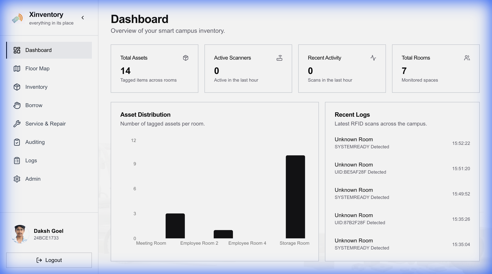
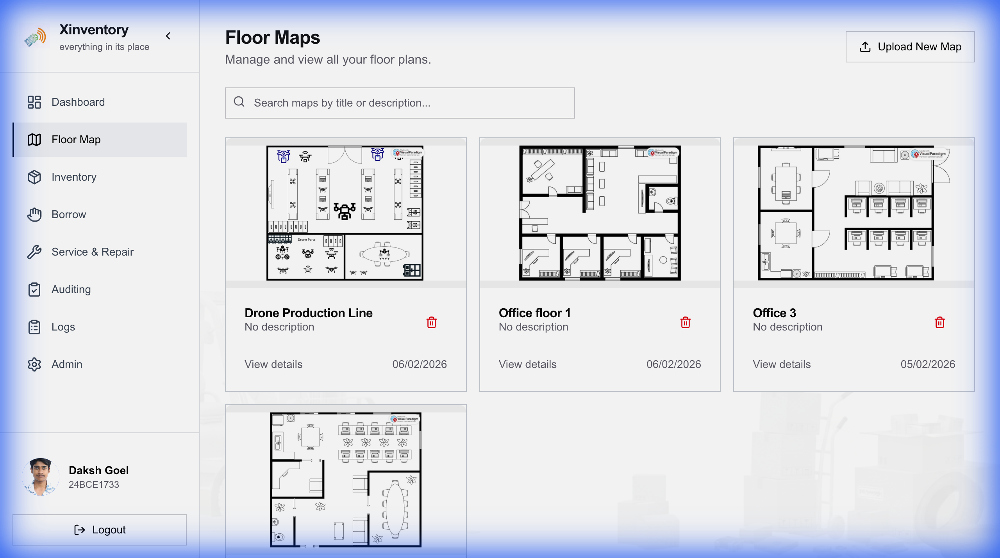
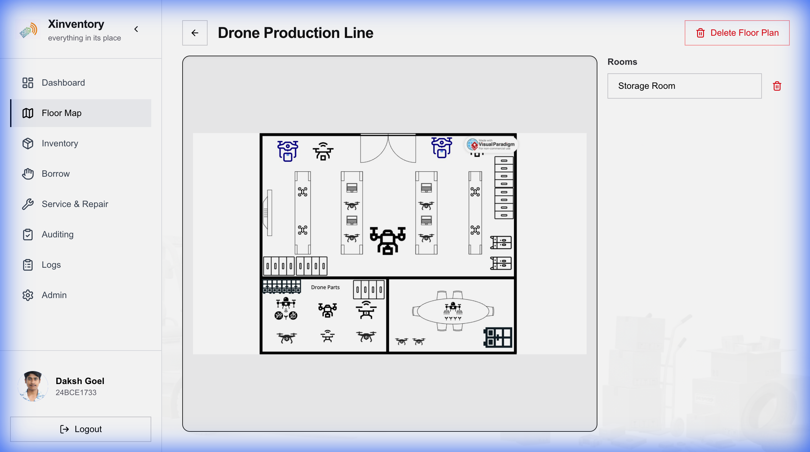
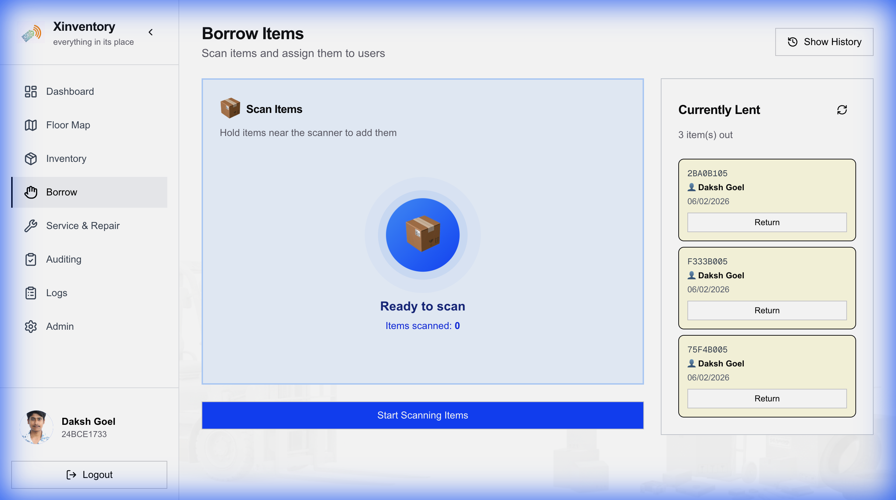

# Smart Lab Inventory (Cyber Forge)


**Smart Lab Inventory** is a comprehensive Enterprise Asset Management (EAM) system designed for laboratories and facilities to track equipment, manage spaces, and streamline lending processes using RFID technology. Built during a hackathon, this project integrates modern web technologies with robust backend services.

[**Live Demo**](https://smart-lab-inventory.vercel.app)


## 🌟 Key Features

- **Real-time Inventory Tracking**: Monitor equipment availability and location using RFID integration.
- **Interactive Floor Plans**: Visualize labs and rooms with dynamic floor plans to locate items.
- **Lend & Borrow System**: seamless check-in/check-out workflow with user history tracking.
- **RFID Management**: Assign, swap, and track RFID tags for inventory items.
- **Service & Repair Tracking**: Manage maintenance schedules and track items sent out for service.
- **Automated Audits**: Schedule and perform periodic audits with PDF report generation.
- **User Roles & Profiles**: Secure authentication with role-based access for admins and users.

## 🛠️ Technology Stack

### Frontend
- **Framework**: [Next.js 16](https://nextjs.org/) (App Router)
- **Styling**: [Tailwind CSS v4](https://tailwindcss.com/)
- **Icons**: [Lucide React](https://lucide.dev/)
- **Maps**: [Leaflet](https://leafletjs.com/)
- **State/Data**: React Hooks, Axios

### Backend
- **Framework**: [Flask](https://flask.palletsprojects.com/) (Python)
- **Database**: [PostgreSQL](https://www.postgresql.org/) (via `psycopg`)
- **Authentication**: Flask-Session (Server-side sessions)
- **Reporting**: ReportLab (PDF Generation)
- **Deployment**: Render (Backend/DB) & Vercel (Frontend)

### Login & Registration
Secure authentication with role-based access.

### Dashboard & Analytics
Real-time overview of inventory stats and recent activity.



### Floor Plans & Room Management
Interactive maps to visualize and locate equipment.

<div style="display: flex; gap: 10px; margin-bottom: 20px;">
  
  
</div>

### Asset Management
Lend, borrow, and track inventory items ease.

<div style="display: flex; gap: 10px; margin-bottom: 20px;">
  
  
</div>

## 🎥 Demo Video

<video src="docs/images/demo_video.mp4" width="100%" controls>
  Your browser does not support the video tag.
</video>

[Watch the Demo Video](docs/images/demo_video.mp4)

## 🚀 Getting Started

### Prerequisites
- Python 3.11+
- Node.js 18+
- PostgreSQL database

### Backend Setup

1. Navigate to the backend directory:
   ```bash
   cd backend
   ```

2. Create a virtual environment:
   ```bash
   python -m venv venv
   source venv/bin/activate  # On Windows: venv\Scripts\activate
   ```

3. Install dependencies:
   ```bash
   pip install -r requirements.txt
   ```

4. Configure environment variables (create a `.env` file or set in shell):
   - `DATABASE_URL`: Connection string for PostgreSQL
   - `FRONTEND_URL`: URL of the frontend (e.g., `http://localhost:3000`)
   - `SESSION_SECRET_KEY`: Random string for session security

5. Run the server:
   ```bash
   python app.py
   ```
   *Server runs on port 8000 by default.*

### Frontend Setup

1. Navigate to the frontend directory:
   ```bash
   cd frontend
   ```

2. Install dependencies:
   ```bash
   npm install
   ```

3. Configure environment variables (create `.env.local`):
   ```env
   NEXT_PUBLIC_API_URL=http://localhost:8000/api
   ```

4. Start the development server:
   ```bash
   npm run dev
   ```
   *Frontend runs on http://localhost:3000*

## 📚 API Endpoints

### Authentication
- `POST /api/register` - Register new user
- `POST /api/login` - User login
- `POST /api/logout` - User logout
- `GET /api/user/me` - Get current user info

### Inventory & Rooms
- `GET /api/floor-plans` - List all floor plans
- `GET /api/rooms` - List all rooms
- `POST /api/items/<id>/assign-rfid` - Assign RFID tag to item
- `GET /api/inventory/all-with-status` - Get comprehensive inventory status

### Lend/Borrow
- `POST /api/lend-borrow/out` - Lend an item
- `POST /api/lend-borrow/in` - Return an item
- `GET /api/lend-borrow/history` - View transaction history

## 🤝 Contributing

This project was created for a hackathon. Contributions are welcome!
1. Fork the repository
2. Create your feature branch (`git checkout -b feature/AmazingFeature`)
3. Commit your changes (`git commit -m 'Add some AmazingFeature'`)
4. Push to the branch (`git push origin feature/AmazingFeature`)
5. Open a Pull Request
