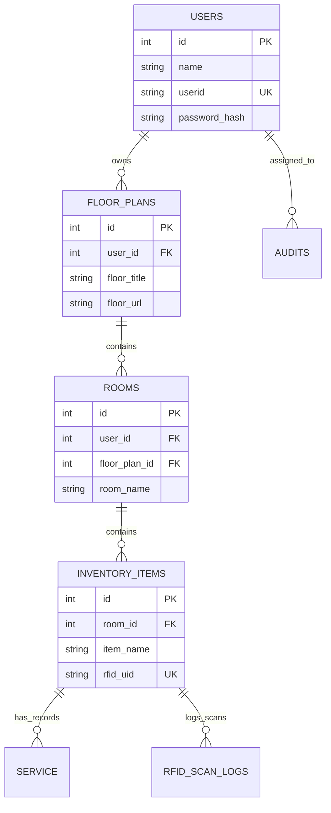

# Backend Architecture Overview - Cyber Forge

The backend is a **Flask-based REST API** designed to manage an inventory system integrated with RFID scanners. It follows a modular monolithic architecture with raw SQL interactions for performance and control.

## Technology Stack

- **Core Framework**: [Flask](https://flask.palletsprojects.com/) (v3.0.0)
- **Language**: Python 3
- **Database**: PostgreSQL (via `psycopg`)
- **Session Management**: [Flask-Session](https://flask-session.readthedocs.io/) (Filesystem-backed)
- **Security**: 
  - `Werkzeug` for password hashing.
  - Custom `@login_required` decorators for route protection.
  - CORS configured for frontend-backend communication.
- **Deployment**: Configured for [Render](https://render.com/) with environment-specific session and SSL settings.

## Modular Structure

The logic is partitioned into functional modules to maintain a clean `app.py`:

- **`app.py`**: The central entry point. Configures the Flask app and defines all API routes (`/api/*`).
- **`auth.py`**: Handles database connection pooling, user registration, and authentication logic.
- **`db_management.py`**: The "Data Access Layer". Contains the schema initialization and CRUD operations for Floor Plans, Rooms, Inventory Items, and RFID Logs.
- **`rfid_uid.py`**: Specialized logic for processing RFID scans and assigning UIDs.
- **`auditing.py`**: Implements the auditing workflow, including scheduling and reports.
- **`serviceandrepair.py`**: Manages the maintenance lifecycle of items.
- **`lendborrow.py`**: Handles tracking of lent/borrowed items.

## Database Schema

The system uses a relational schema with the following core entities:

## Key Workflows

1. **RFID Integration**: Scanners send POST requests to `/api/rfid/scan`. The backend identifies the item/user associated with the RFID and logs the event.
2. **Audit System**: Admins schedule audits. Users perform scans which are matched against the inventory to determine status.
3. **Session-Based Auth**: Uses server-side sessions. Successful login returns a session cookie.
